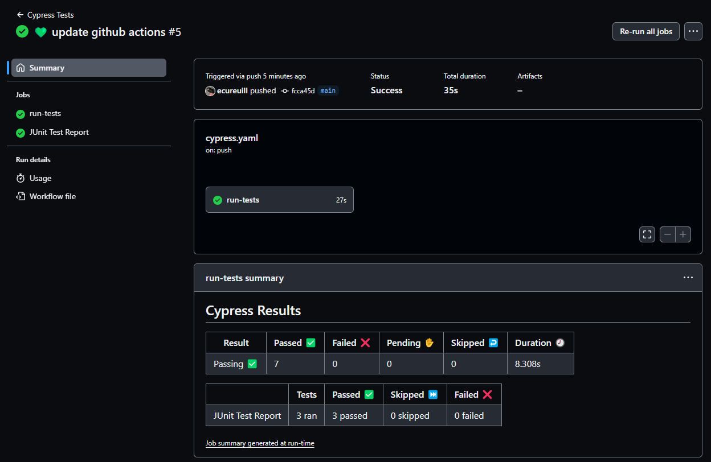

# Starbugs Coffee e2e with Cypress

This project is an initial study on how to perform end-to-end (E2E) testing of the Starbugs Coffee webapp using Cypress Framework. The main objective is to learn how Cypress can be used to automate user interface tests and improve the quality of the software.

# Reporter
Cypress generates JUnit XML test reports. These reports can be used to integrate with various third-party tools and services for further analysis and visualization.

## GitHub Workflow Action

The workflow includes an action that processes the JUnit XML test reports generated during the test run and displays the results as a pull request check with a summary and annotations. This provides a clear and concise overview of the test results directly within the pull request, facilitating collaboration and code review.



## Running locally

To run tests locall, you will need the following 
- nodejs installed
- cypress installed

### Steps

1. Clone this repository
1. Navigate to the project directory
1. Install the project dependencies
    ```bash
    npm install
    ```
1. Run tests from  cypress from CLI
    ```bash
    npx cypress run
    ```
1. Alternatively, open Cypress UI to run tests
    ```bash
    npx cypress open
    ```
